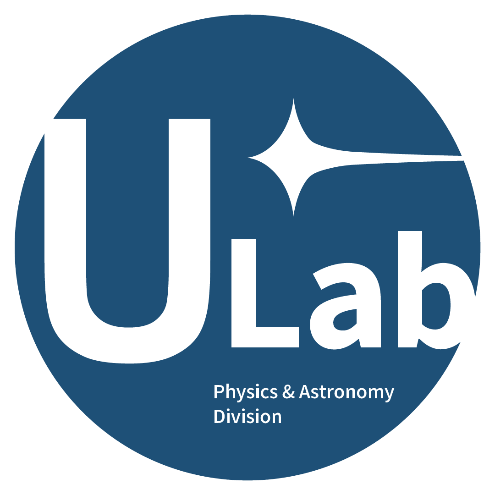

  

<h1 align="center">Undergraduate Laboratory at Berkeley</h1>
<h3 align="center">Physics and Astronomy Division</h3>

Empowering undergraduates in research, innovation, and scientific discovery.

---

## 📚 General Info

- **Meeting Times**: Mondays and Wednesdays, 7–8 PM, Campbell Hall 131
- **Missed Workshop**: [Fill out this form](#) <!-- Replace # with real link -->
- **Missed Group Meeting**: [Fill out this form](#) and notify your mentor
- **Slack Join Link**: [Join here](#)
- **Website**: [ULAB Website](#)
- **Anonymous Feedback**: [Submit feedback](#)

---

# 🧑‍🏫 For Mentors
- **Checkoff Guidelines**: [View guidelines](#)
- **Checkoff Submission Form**: Pinned in the Slack Staff Channel

---
# 📬 Contact Us
Please email us at: **ulab@berkeley.edu**

---

## **Directors**

<table>
<tr>
<td align="center" width="150px">
   
  <b>Saahit Mogan</b> 
  <a href="mailto:smogan@berkeley.edu">smogan@berkeley.edu</a>
</td>
<td align="center" width="150px">
   
  <b>Jordan Duan</b> 
  <a href="mailto:jordanduan@berkeley.edu">jordanduan@berkeley.edu</a>
</td>
</tr>
</table>

---

## **Lab Managers**

<table>
<tr>
<td align="center" width="150px">
   
  <b>Andrew McHaty</b> 
  <a href="mailto:andrew.mchaty@berkeley.edu">andrew.mchaty@berkeley.edu</a>
</td>
<td align="center" width="150px">
   
  <b>Yaamini Jois</b> 
  <a href="mailto:yjois@berkeley.edu">yjois@berkeley.edu</a>
</td>
</tr>
</table>

---

## **Curriculum Manager**

<table>
<tr>
<td align="center" width="150px">
   
  <b>Brianna Peck</b> 
  <a href="mailto:bpeck114@berkeley.edu">bpeck114@berkeley.edu</a>
</td>
</tr>
</table>

---

## **Python Lecturer**

<table>
<tr>
<td align="center" width="150px">
   
  <b>Caitlin Begbie</b> 
  <a href="mailto:caitlinbegbie@berkeley.edu">caitlinbegbie@berkeley.edu</a>
</td>
</tr>
</table>

---

## **Faculty Sponsor**

<table>
<tr>
<td align="center" width="150px">
   
  <b>Dan Kasen</b> 
  <a href="mailto:kasen@berkeley.edu">kasen@berkeley.edu</a>
</td>
</tr>
</table>

---

# 📅 Fall Course Schedule

| Week | Monday Date | Monday | Wednesday | Sunday HW Due |
|:---|:---|:---|:---|:---|
| 1 | 1/20 |  | Welcome Back |
| 2 | 1/27 | Python I–V Review   [📄 Slides](#) | GM 11   [📝 Assignment](#) | Module 6 or Advanced 6 |
| 3 | 2/3 | Python VI (Data with NumPy)   [📄 Slides](#) | GM 12   [📝 Assignment](#) | Module 7 or Advanced 7 |
| 4 | 2/10 | Python VII (Pandas)   [📄 Slides](#) | GM 13 | Start Module 8 |
| 5 | 2/17 | Python VIII (AstroPy)   [📄 Slides](#) | GM 14 | Finish Module 8 |
| 6 | 2/24 | Holiday | GM 15 | |
| 7 | 3/3 | Mid-Semester Discussion | Mid-Semester | | 
| 8 | 3/10 | Python IX (SciPy: Curve-fitting)   [📄 Slides](#) | GM 16 | Stats I Module |
| 9 | 3/17 | Python X (Advanced Plotting)   [📄 Slides](#) | GM 17 | Stats II Module |
| 10 | 3/24 | Spring Break | Spring Break | |
| 11 | 3/31 | GM 18 | GM 19 |
| 12 | 4/7 | Poster Making | GM 20 |
| 13 | 4/14 | GM 21 | GM 22 |
| 14 | 4/21 | Research Panel | GM 23 | Poster Due |
| 15 | 4/28 | GM 24 | GM 25 |
| 16 (RRR Week) | 5/5 | Poster Presentations |
| 17 (Finals) | 5/12 | No Instruction |

<!-- You can continue filling in the full course summary list if you want -->

---

---

# 📅 Spring Course Schedule

| Week | Monday Date | Monday | Wednesday | Sunday HW Due |
|:---|:---|:---|:---|:---|
| 1 | 1/20 |  | Welcome Back |
| 2 | 1/27 | Python I–V Review   [📄 Slides](#) | GM 11   [📝 Assignment](#) | Module 6 or Advanced 6 |
| 3 | 2/3 | Python VI (Data with NumPy)   [📄 Slides](#) | GM 12   [📝 Assignment](#) | Module 7 or Advanced 7 |
| 4 | 2/10 | Python VII (Pandas)   [📄 Slides](#) | GM 13 | Start Module 8 |
| 5 | 2/17 | Python VIII (AstroPy)   [📄 Slides](#) | GM 14 | Finish Module 8 |
| 6 | 2/24 | Holiday | GM 15 | |
| 7 | 3/3 | Mid-Semester Discussion | Mid-Semester | | 
| 8 | 3/10 | Python IX (SciPy: Curve-fitting)   [📄 Slides](#) | GM 16 | Stats I Module |
| 9 | 3/17 | Python X (Advanced Plotting)   [📄 Slides](#) | GM 17 | Stats II Module |
| 10 | 3/24 | Spring Break | Spring Break | |
| 11 | 3/31 | GM 18 | GM 19 |
| 12 | 4/7 | Poster Making | GM 20 |
| 13 | 4/14 | GM 21 | GM 22 |
| 14 | 4/21 | Research Panel | GM 23 | Poster Due |
| 15 | 4/28 | GM 24 | GM 25 |
| 16 (RRR Week) | 5/5 | Poster Presentations |
| 17 (Finals) | 5/12 | No Instruction |
---
# 📝 Grading Breakdown

| Category | Weight | Description |
|:---|:---|:---|
| Checkoffs | 30% | Attendance and participation quick-checks |
| Assignments | 30% | Weekly homework assignments |
| Mid-Semester Assignment | 10% | Group mid-semester report/presentation |
| Final Assignment | 30% | Project proposal or final poster/presentation |

---

## 📋 Grading Details

- **Checkoffs (30%)**
  - Quick activities to ensure attendance and participation in workshops/group meetings.
  - Different from assignments: no work outside of lecture required.
  - Students attending lectures/group meetings and attempting checkoffs will receive full credit.
  - Students missing lectures/group meetings but giving at least **12 hours notice** can receive full credit.
  - Students missing without notice will receive **no credit**.
  - No partial credit is given.

- **Assignments (30%)**
  - Weekly homework assignments based on Monday lectures.
  - Due every Sunday night at **11:59 PM**.

- **Mid-Semester Assignment (10%)**
  - A mid-semester report or presentation done with your group.
  - Based on your project ideas and progress.

- **Final Assignment (30%)**
  - In Fall: a **Project Proposal Document** and **Presentation**.
  - In Spring: a **Final Poster** and **Poster Presentation**.

- **Passing Grade**: Final grade ≥ 70% required.

<!-- You can continue filling in the full course summary list if you want -->

---
