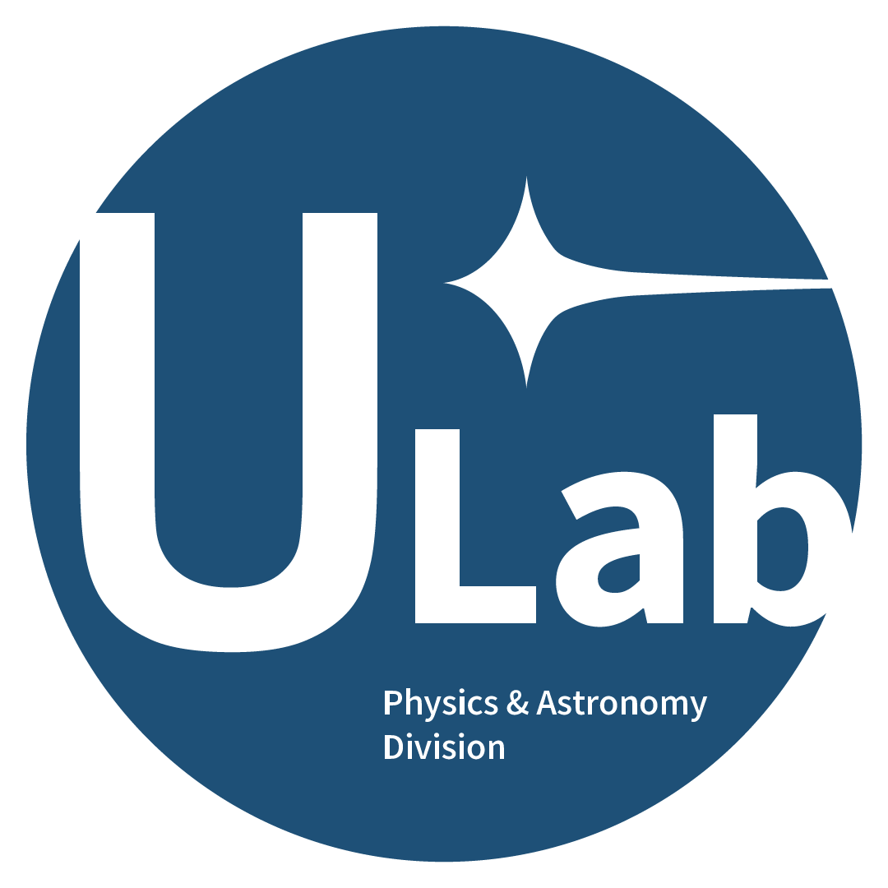

# 👥 Staff

For logistics or questions, please contact us at **[physics@ulab.berkeley.edu](mailto:physics@ulab.berkeley.edu)**.

---

## 🎓 Directors

<table>
<tr>
  <td align="center" width="200">
     
    <strong>Saahit Mogan</strong>  
     <code>Director</code> <code>Staff Email Access</code>
     <a href="mailto:smogan@berkeley.edu">smogan@berkeley.edu</a>
     Enjoys physics and helping students succeed!
  </td>
  <td align="center" width="200">
     
    <strong>Jordan Duan</strong>  
     <code>Director</code> <code>Staff Email Access</code>
     <a href="mailto:jordanduan@berkeley.edu">jordanduan@berkeley.edu</a>
     Ask me about posters, mentorship, or Python :)
  </td>
</tr>
</table>

---

## 🧪 Lab Managers

<table>
<tr>
  <td align="center" width="200">
     
    <strong>Andrew McHaty</strong>  
     <code>Lab Manager</code>
     <a href="mailto:andrew.mchaty@berkeley.edu">andrew.mchaty@berkeley.edu</a>
     Looking forward to a great year of research!
  </td>
  <td align="center" width="200">
     
    <strong>Yaamini Jois</strong>  
     <code>Lab Manager</code>
     <a href="mailto:yjois@berkeley.edu">yjois@berkeley.edu</a>
     Ask me about ULAB logistics or projects!
  </td>
</tr>
</table>

---

## 🧠 Curriculum Manager

<table>
<tr>
  <td align="center" width="200">
     
    <strong>Brianna Peck</strong>  
     <code>Curriculum Manager</code>
     <a href="mailto:bpeck114@berkeley.edu">bpeck114@berkeley.edu</a>
     I help design workshops & learning material!
  </td>
</tr>
</table>

---

## 💻 Python Lecturer

<table>
<tr>
  <td align="center" width="200">
     
    <strong>Caitlin Begbie</strong>  
     <code>Lecturer</code>
     <a href="mailto:caitlinbegbie@berkeley.edu">caitlinbegbie@berkeley.edu</a>
     I love Python and helping students learn code!
  </td>
</tr>
</table>

---

## 🧑‍🏫 Faculty Sponsor

<table>
<tr>
  <td align="center" width="200">
     
    <strong>Dan Kasen</strong>  
     <code>Faculty Sponsor</code>
     <a href="mailto:kasen@berkeley.edu">kasen@berkeley.edu</a>
     Professor in Physics & Astronomy. Supports ULAB!
  </td>
</tr>
</table>
